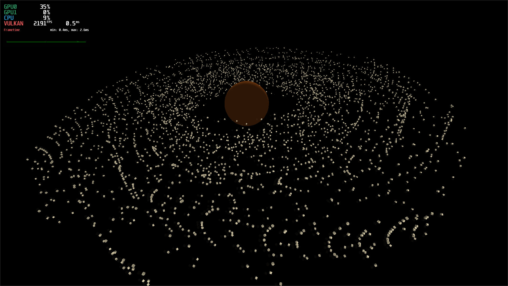

# RustingEngine

<!--[](https://github.com/GoingRusting/RustingEngine/actions/workflows/ci.yml)-->

**10,000 GPU-simulated cubes at more than 2,000 FPS on an RTX 3060.**
RustingEngine is built for physics-heavy scenes that can overwhelm traditional
CPU-first engines long before the GPU is fully used.



The screenshot shows the current native space demo in a 1920×1080 release
build. All 10,000 satellites are rendered through instancing and updated with
Vulkan compute rather than 10,000 CPU-side object updates.

| Benchmark            | Value                                             |
| -------------------- | ------------------------------------------------- |
| Scene                | One planet and 10,000 moving cubes                |
| Measured result      | 2,191 FPS / 0.5 ms frame time                     |
| GPU                  | NVIDIA GeForce RTX 3060 12 GB                     |
| CPU                  | AMD Ryzen 5 7600X, 6 cores / 12 threads           |
| Memory               | 16 GB RAM                                         |
| Operating system     | CachyOS Linux                                     |
| Resolution           | 1920×1080                                         |
| Captured utilization | 35% GPU / 9% CPU                                  |
| Build                | Native Rust release build, measured with MangoHUD |

This is a measurement of one deliberately GPU-friendly stress scene, not a
promise that every game will run at the same speed. Performance depends on the
solver, shaders, visible geometry, hardware, and gameplay work.

## Why RustingEngine exists

Most game engines keep authoritative physics on the CPU. That is useful for
gameplay queries, but it becomes expensive when thousands of independent
bodies must be updated. RustingEngine uses a hybrid model:

- CPU simulation is available for objects that need immediate gameplay access.
- Vulkan compute handles large effect, debris, crowd, and simulation workloads.
- GPU conditions return small, meaningful events to Rust without downloading
  every body transform—for example, when any member of a class enters an area.
- Instanced batches keep thousands of equal meshes from becoming thousands of
  draw calls.

The goal is not to move everything blindly to the GPU. The game chooses which
objects need CPU authority, which can stay GPU-owned, and what information must
cross between them.

## Included in v1.0.0

- Vulkan renderer with depth buffering, resize handling, materials, cameras,
  instancing, indirect drawing, and optional frustum culling
- Fixed-step GPU physics with built-in and custom compute shader profiles
- Stable GPU body IDs, object classes, programmable conditions, and
  asynchronous GPU-to-Rust events
- Native Rust gameplay code with normal Cargo dependencies
- Scene editor with a dockable layout, hierarchy, inspector, asset browser,
  Rust/GLSL editor, console, and Debug/Release Play modes
- Versioned text scenes, cooked runtime scenes, project creation, and game export
- Linux and Windows CI and release packaging

RustingEngine v1.0.0 is the first public release. It is suitable for experiments,
stress scenes, and early games, but the editor and physics APIs will continue to
grow.

## Quick start

You need stable Rust and a Vulkan-capable driver. Linux and Windows are the
primary platforms.

```bash
git clone https://github.com/GoingRusting/RustingEngine.git
cd RustingEngine
./scripts/run_editor.sh
```

To run the included 10,000-cube space project without the editor:

```bash
cd testGame
mangohud cargo run --release
```

To run the original renderer stress test:

```bash
cargo run --release -p rusting_engine --bin user_main
```

The editor creates complete Rust projects in a directory you choose. **Play**
saves and cooks the scene, compiles the game's Rust code, and starts a separate
native window. Debug mode compiles quickly during development; Release enables
the settings used for performance measurements.

## Small Rust gameplay API

A game project is a normal Cargo project. Simple behavior stays short, while
advanced projects can use ECS systems and any compatible Rust crate directly.

```rust
use rusting_engine::prelude::*;

fn update(scene: &mut GameScene<'_>, time: &FrameTime) {
    scene.object("Planet").rotate_y(0.2 * time.delta_seconds());
}

rusting_game!(update);
```

Procedural objects can share a class, material, mesh, and GPU physics profile.
GPU rules can then watch that class and send only matching events back to Rust.
See [the included space project](testGame/src/main.rs) and
[hybrid GPU example](src/examples/hybrid_10k.rs) for complete examples.

## Project layout

- `src/runtime` — ECS, time, hierarchy, scenes, and hybrid physics types
- `src/rendering` — Vulkan context, compute profiles, and scene renderer
- `src/editor` — dockable editor and reusable GUI elements
- `src/project_runner.rs` — concise native Rust game API and game window
- `testGame` — the 10,000-cube space project shown above
- `roadmap.md` — implemented work and planned engine milestones

More documentation:

- [Editor guide](editor_gui.md)
- [Architecture](architecture.md)
- [Roadmap](roadmap.md)
- [Release guide](RELEASE.md)
- [Contributing](CONTRIBUTING.md)

## Contributing

Bug reports, profiling results, documentation fixes, and focused pull requests
are welcome. Please read [CONTRIBUTING.md](CONTRIBUTING.md) before opening a PR.
Performance changes should include the scene, hardware, resolution, build mode,
and before/after measurements so results can be reproduced.

## License

RustingEngine uses the [Rusting Engine License 1.0](LICENSE.md). Games and other
created works may be commercial. Redistribution of the engine is subject to the
license terms and attribution requirements.
