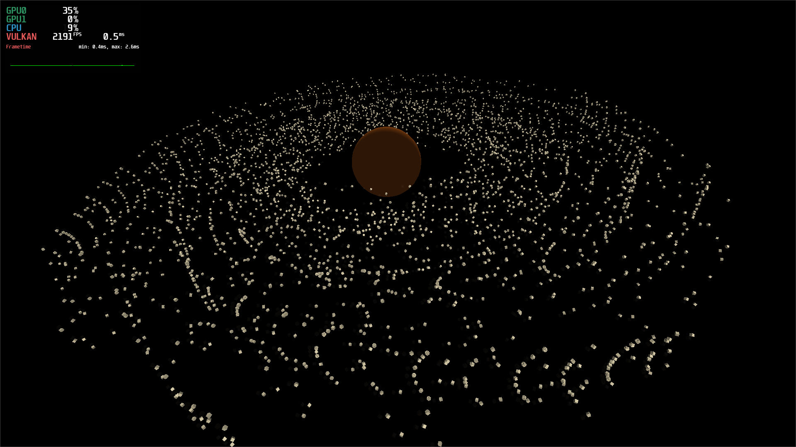

# RustingEngine

<!--[](https://github.com/GoingRusting/RustingEngine/actions/workflows/ci.yml)-->

**10,000 GPU-simulated cubes at more than 2,000 FPS on an RTX 3060.**
RustingEngine is built for physics-heavy scenes that can overwhelm traditional
CPU-first engines long before the GPU is fully used.



The screenshot shows the current native space demo in a 1920×1080 release
build. All 10,000 satellites are rendered through instancing and updated with
Vulkan compute rather than 10,000 CPU-side object updates.

| Benchmark            | Value                                             |
| -------------------- | ------------------------------------------------- |
| Scene                | One planet and 10,000 moving cubes                |
| Measured result      | 2,191 FPS / 0.5 ms frame time                     |
| GPU                  | NVIDIA GeForce RTX 3060 12 GB                     |
| CPU                  | AMD Ryzen 5 7600X, 6 cores / 12 threads           |
| Memory               | 16 GB RAM                                         |
| Operating system     | CachyOS Linux                                     |
| Resolution           | 1920×1080                                         |
| Captured utilization | 35% GPU / 9% CPU                                  |
| Build                | Native Rust release build, measured with MangoHUD |

This is a measurement of one deliberately GPU-friendly stress scene, not a
promise that every game will run at the same speed. Performance depends on the
solver, shaders, visible geometry, hardware, and gameplay work.

## Why RustingEngine exists

Most game engines keep authoritative physics on the CPU. That is useful for
gameplay queries, but it becomes expensive when thousands of independent
bodies must be updated. RustingEngine uses a hybrid model:

- CPU simulation is available for objects that need immediate gameplay access.
- Vulkan compute handles large effect, debris, crowd, and simulation workloads.
- GPU conditions return small, meaningful events to Rust without downloading
  every body transform—for example, when any member of a class enters an area.
- Instanced batches keep thousands of equal meshes from becoming thousands of
  draw calls.

The goal is not to move everything blindly to the GPU. The game chooses which
objects need CPU authority, which can stay GPU-owned, and what information must
cross between them.

## What is included

- **Rendering:** a Vulkan renderer with PBR materials, lights, shadows,
  instancing, indirect drawing, and GPU frustum culling.
- **Physics:** fixed-step CPU and GPU physics with built-in and custom
  compute shaders, CPU joints (hinge, slider, ball socket, cone twist,
  distance, spring, and six-axis with limits, springs, and motors),
  reduced-coordinate articulations for drift-free chains and ragdolls, stable GPU body IDs, object classes, and GPU conditions
  that send small events back to Rust.
- **Determinism:** a per-project determinism mode, seeded random streams, a
  world-state hash for every tick, replays, and `rusting determinism` to
  find the first tick where two runs differ. See
  [Determinism](docs/determinism.md).
- **Game code:** ordinary Rust with any Cargo dependency, ECS systems, named
  input actions, and your own components saved in scenes through the
  `reflect!` macro.
- **Editor:** Blender-style areas, Hierarchy, a typed Inspector, asset
  import, a transform gizmo with snapping, in-editor Preview, native Play,
  a Rust and GLSL code editor, rebindable shortcuts, and a Profiler.
- **Command line:** the `rusting` tool creates, checks, runs, tests,
  captures, and exports projects with no window, and edits scenes with
  patches. `rusting schema` lists every command and component field.
- **Scenes and export:** versioned text scenes with field migrations,
  cooked runtime scenes, and self-contained game exports.
- Linux and Windows CI and release packages.

The engine is suitable for experiments, stress scenes, and early games. The
editor and physics APIs are still growing; see the [changelog](CHANGELOG.md)
for each release and the [roadmap](roadmap.md) for what comes next.

## Quick start

You need stable Rust and a Vulkan-capable driver. Linux and Windows are the
primary platforms.

New to the engine? Follow [Getting started](docs/getting-started.md) and the
[tutorials](docs/README.md).

```bash
git clone https://github.com/GoingRusting/RustingEngine.git
cd RustingEngine
./scripts/run_editor.sh
```

To run the included 10,000-cube space project without the editor:

```bash
cd testGame
mangohud cargo run --release
```

To run the original renderer stress test:

```bash
cargo run --release -p rusting_engine --bin user_main
```

The editor creates complete Rust projects in a directory you choose. **Play**
saves and cooks the scene, compiles the game's Rust code, and starts a separate
native window. Debug mode compiles quickly during development; Release enables
the settings used for performance measurements.

## Headless project CLI

The `rusting` binary creates, checks, builds, runs, exports, and captures
projects without opening the editor. Only `capture` uses Vulkan. Run these
examples from the engine checkout:

```bash
cargo run --bin rusting -- doctor --json
cargo run --bin rusting -- new /tmp "My Game" --json
cargo run --bin rusting -- new /tmp "My Platformer" --template 2d --json
cargo run --bin rusting -- new /tmp "Coin Run" --template starter --json
cargo run --bin rusting -- new /tmp "My Shooter" --template first-person --json
cargo run --bin rusting -- project inspect "/tmp/My Game" --json
cargo run --bin rusting -- scene inspect "/tmp/My Game/scenes/main.rscene" --json
cargo run --bin rusting -- scene query "/tmp/My Game/scenes/main.rscene" --name Cube --json
cargo run --bin rusting -- scene query testGame/scenes/main.rscene --class camera --json
cargo run --bin rusting -- scene patch "/tmp/My Game/scenes/main.rscene" /tmp/patch.json --dry-run --json
cargo run --bin rusting -- validate "/tmp/My Game" --json
cargo run --bin rusting -- cook "/tmp/My Game" --json
cargo run --bin rusting -- check "/tmp/My Game" --json
cargo run --bin rusting -- run "/tmp/My Game" --ticks 120 --json
cargo run --bin rusting -- test "/tmp/My Game" /tmp/falls.json --json
cargo run --bin rusting -- export "/tmp/My Game" /tmp/exports --json
cargo run --bin rusting -- capture "/tmp/My Game/scenes/main.rscene" /tmp/shot.png --tick 60 --pick 640,360 --json
cargo run --bin rusting -- asset import "/tmp/My Game" art/crate.png --to props --license CC0-1.0 --json
cargo run --bin rusting -- asset reimport "/tmp/My Game" assets/props/crate.png --from art/crate_v2.png --json
cargo run --bin rusting -- asset list "/tmp/My Game" --json
cargo run --bin rusting -- asset generate "/tmp/My Game" icons "red crate" --to props --dry-run --json
cargo run --bin rusting -- preset apply "/tmp/My Game/scenes/main.rscene" golden_hour --json
cargo run --bin rusting -- schema --json
cargo run --bin rusting -- scene query --help
```

`--json` returns one object with `schema_version`, `ok`, `data`, and
`diagnostics`; failures still print JSON and exit nonzero. Exit code 2 means
invalid arguments, and exit code 1 means a project, scene, or operation error.
Scene queries also accept `--id`, `--class`, and `--component`. Query results
include full entity component data in persistent ID order. A missing Vulkan
device is reported by `doctor` and does not block the other commands.

`run` reports `timings`: the build time, the game's own time to its first
playable frame, and the command-to-first-frame total. A failed build lists
each Rust or shader error as its own diagnostic with file and line
(`RUST_BUILD_ERROR`, `SHADER_BUILD_ERROR`), and asset hot reload failures the
game printed come back as `ASSET_RELOAD_FAILED` warnings. The editor's Play
and Restart write the same timing and per-file errors to the Console.

`check` runs `cargo check` on the game. `run` cooks, builds, and starts the
game; `--ticks N` runs N fixed ticks without a window and exits. `export`
builds a release, packages it like the editor's Export, and then runs a copy
for 60 headless ticks from a fresh temporary folder to verify it. `capture`
renders one camera (`--camera` takes a persistent ID or a name) after N fixed
ticks to a PNG. Each `--pick X,Y` returns the persistent ID, name, and world
position of the object under that pixel, found by ray casting against mesh
bounds. Game code does not run during a capture. Without Vulkan, `capture`
still reports the camera and picks, with a `VULKAN_UNAVAILABLE` error.

`schema` prints a catalog of every command (usage, flag defaults, an
example, and GPU/readback cost), every scene entity section and registered
component (default value, an example, and each field's unit and valid range),
and the scenario format. Defaults come from the engine's own `Default`
values saved through the scene writer, and tests keep the field list, the
examples, and the component registry in step.

### Scene patches

`scene patch <scene> <patch.json> [--dry-run]` applies a batch of
operations to a scene as one unit:

```json
{
  "expected_revision": "3f0c1a2b4d5e6f70",
  "operations": [
    {"op": "set", "id": "UUID", "path": "/transform/position/1", "value": 2.0, "expected": 1.0},
    {"op": "create", "entity": {"name": "Crate", "parent": null}},
    {"op": "duplicate", "id": "UUID", "name": "Cube Copy"},
    {"op": "reparent", "id": "UUID", "parent": null},
    {"op": "remove", "id": "UUID", "path": "/collider"},
    {"op": "delete", "id": "UUID"}
  ]
}
```

Entities are addressed by persistent ID; paths are JSON pointers into the
entity's scene form with registered components parsed, as in scenario
`expect` paths. Either every operation succeeds and the result passes the
scene loader's checks (types, unique IDs and names, parents, and built-in
component values), or nothing is written. The result lists created and
deleted IDs and every changed field with its old and new value. `scene
inspect` and `scene query` report the file's `revision`; a patch whose
`expected_revision` or per-field `expected` value no longer matches fails
with `SCENE_CONFLICT`.

An open editor watches its scene file. When it has no unsaved edits it
reloads an outside change behind an Undo step, so Undo reverts it. With
unsaved edits it keeps them and reports the conflict, and the next Save
refuses once before it overwrites the outside change.

### Scenario tests

`test` builds the game and runs a scenario file inside it without a window.
The game's own systems run, one fixed step per tick, with `RandomSeed` set
from `seed`. Steps run at fixed ticks:

```json
{
  "name": "cube falls",
  "seed": 3,
  "ticks": 60,
  "capture_size": [640, 360],
  "steps": [
    {"tick": 5, "press": "jump"},
    {"tick": 6, "release": "jump"},
    {"tick": 30, "expect": {"entity": "Cube", "path": "/transform/position/1", "less_than": 0.0}},
    {"tick": 0, "until": 60, "expect": {"entity": "Cube", "path": "/transform/position/1", "greater_than": -9.0}},
    {"tick": 60, "expect_events": {"kind": "collision", "entity": "Cube", "at_least": 1}},
    {"tick": 30, "capture": "shots/tick30.png"}
  ]
}
```

- `press` and `release` act on every input bound to a named action in
  `ActionMap`. They apply before that tick's update.
- `expect` reads a JSON pointer from the entity's scene form, the same JSON
  that `scene query` prints. Registered components are parsed, so paths such
  as `/components/<type>/<field>` work. Use `equals` (with `tolerance` for
  numbers), `greater_than`, or `less_than`. With `until`, the check runs on
  every tick through that one.
- `expect_events` counts events that gameplay saw from tick 0 through this
  tick. `collision` is the only kind for now.
- `capture` writes a PNG relative to the scenario file. Without Vulkan, it is
  skipped rather than failed.

The run stops at the first failed step, unless the scenario sets
`"keep_going": true`, which reports every failed step. A failure exits 1 with
`SCENARIO_FAILED` and the message `tick T step S: ...`. The JSON report,
including the value the failed check saw, is under `data.scenario`. Game
binaries run a scenario themselves when `RUSTING_TEST_SCENARIO` names the
file; they write the report to `RUSTING_TEST_REPORT`.

## Small Rust gameplay API

A game project is a normal Cargo project. Simple behavior stays short, while
advanced projects can use ECS systems and any compatible Rust crate directly.

```rust
use rusting_engine::prelude::*;

fn update(scene: &mut GameScene<'_>, time: &FrameTime) {
    scene.object("Planet").rotate_y(0.2 * time.delta_seconds());
}

rusting_game!(update);
```

The game-feel kit is plain scene data plus Rust APIs, so `scene patch`,
scenarios, and the inspector all reach it: `rusting.player_controller` (a
first-person body with a child camera, driven by `player.*` actions in
`ActionMap`), `rusting.tween` (eased position, rotation, or scale),
`rusting.sound_cue` (sends a `SoundEvent` on contact or `trigger()`; the game
plays it, since the engine has no audio output yet), `rusting.burst_emitter`
(short-lived particles on contact or `trigger()`), and `rusting.hud` (text or
a button that sends `HudButtonPressed`). `rusting schema` lists their fields.

Imported assets get a `<file>.rmeta` sidecar with a stable ID that survives
`asset reimport`, import settings (`--max-size` for images), the glTF's
buffer and image dependencies, a content hash, and source/license
provenance. `asset list` and `validate` report missing files and
dependencies; `asset list` also warns about missing licenses, files changed
since import, and files that were never imported. WAV and Ogg files import
as audio. `--dry-run` previews an import or replacement without writing;
the editor's Assets area uses the same preview for its Replace… action.

`determinism` in `project.json` (`Off` by default, `Local`, or
`CrossPlatform`) asks the simulation to reproduce itself on one machine or
on every device. `cook` copies it into the cooked scene, the game refuses
to start when a solver or system does not support it, and `validate` names
each such part. Built-in solvers support `Local` today. A custom compute
shader states its level with a `// rusting: determinism = local` line, and
game systems declare theirs through `DeterminismSupport`. [docs/determinism.md](docs/determinism.md) lists
the math rules behind `CrossPlatform`.

Generator hooks are optional. A project may list commands under
`generators` in `project.json`, for any tool or model service:

```json
"generators": {"icons": {"command": ["python3", "tools/make_icon.py"],
                         "license": "CC0-1.0", "settings": {"max_size": 256}}}
```

`asset generate <project> <hook> <prompt>` runs the command from the
project root with `RUSTING_PROMPT` and an empty `RUSTING_OUTPUT_DIR`. The
command writes a file there and prints a last line such as
`{"file": "icon.png", "author": "..."}`. The file then goes through the
normal importer (or replaces `--replace ASSET`), and output without a
license is rejected.

`preset apply` writes a
starter look (`daylight`, `golden_hour`, `night`, `flat_toy`) as ordinary
scene data: sun, ambient and sky light, tone mapping, `rusting.background`,
camera field of view, and HUD text size and color.

`new --template first-person` creates a lit room with crates and a
kinematic capsule player: `rusting.player_controller` walks with WASD, runs
with Shift, jumps with Space, and looks with the mouse once a click captures
the cursor. `--template third-person` is the same room with a visible player
body; the controller's `camera_distance` swings the child camera behind the
body. `--template sandbox` drops a stack of dynamic boxes and two balls onto
a walled floor, a starting point for physics experiments.

For 2D games, `new --template 2d` creates a side-view platformer. Sprites
are `MeshRenderer`s with the `Quad` primitive and an unlit material, the
camera is orthographic, `rusting.tile_map` turns text rows into tiles with
one box collider per solid run, and `rusting.platformer_controller` runs and
jumps with the `player.*` actions. Physics stays 3D in the XY plane.

`new --template starter` creates Coin Run, a complete small 2D game built
from the same scene data: five coins with `rusting.pickup`, a
`rusting.counter` shown by a HUD line such as `Coins {coins}/5`, and a flag
pickup that `requires` every coin before it counts as a win and shows the
"You win!" HUD element. `rusting capture` paints HUD text over the frame.
`samples/starter_game/` holds the one-paragraph request and the winning
scenario; the acceptance exercise replays the whole create, patch, run,
capture, test, and export loop through the CLI and writes a timing report:

```bash
RUSTING_ACCEPTANCE_REPORT=/tmp/starter.json \
  cargo test --test starter_game -- --ignored --nocapture
```

Presets tone-map and restyle the HUD of 2D unlit art too, so the exercise
corrects the background and tone mapping with a scene patch afterwards.

Procedural objects can share a class, material, mesh, and GPU physics profile.
GPU rules can then watch that class and send only matching events back to Rust.
See [the included space project](testGame/src/main.rs) and
[hybrid GPU example](src/examples/hybrid_10k.rs) for complete examples.

## Project layout

- `crates/rusting-core` — ECS app, schedule, time, input, and events, with
  no rendering
- `src/runtime` — scenes, hierarchy, snapshots, and hybrid physics
- `src/rendering` — Vulkan context, compute profiles, and scene renderer
- `src/reflect` — the `reflect!` macro and the field descriptions that scene
  saving, the Inspector, and `rusting schema` share
- `src/editor` — the editor and its shared GUI widgets
- `src/cli.rs`, `src/bin/rusting.rs` — the `rusting` command-line tool
- `src/project_runner.rs` — the short native Rust game API and game window
- `testGame` — the 10,000-cube space project shown above
- `samples` — the starter game, the Hammer Run obstacle course, the Target Range shooting gallery, the Sky Hop platformer, the Ember Arena survival game, the Tower Topple throwing game, the Crate Keeper puzzle, the Brick Bounce brick breaker, the Core Defense turret shooter, the Putt Course mini golf hole, the Lantern Grid puzzle, the Snake Trail arcade game, the Night Vault stealth game, and the vertical-slice sample
- `benchmarks` — render benchmark baselines
- `docs` — getting started, concepts, tutorials, and guides

More documentation:

- [Documentation index](docs/README.md): getting started, core concepts, and
  tutorials
- [Game-making skill for LLM agents](skills/rusting-game/SKILL.md): copy
  it to `.claude/skills/rusting-game/` or give it to any agent that builds
  games with the `rusting` CLI
- [Editor guide](editor_gui.md)
- [Architecture](architecture.md)
- [Roadmap](roadmap.md)
- [Release guide](RELEASE.md)
- [Contributing](CONTRIBUTING.md)

## Contributing

Bug reports, profiling results, documentation fixes, and focused pull requests
are welcome. Please read [CONTRIBUTING.md](CONTRIBUTING.md) before opening a PR.
Performance changes should include the scene, hardware, resolution, build mode,
and before/after measurements so results can be reproduced.

## License

RustingEngine uses the [Rusting Engine License 1.0](LICENSE.md). Games and other
created works may be commercial. Redistribution of the engine is subject to the
license terms and attribution requirements.
